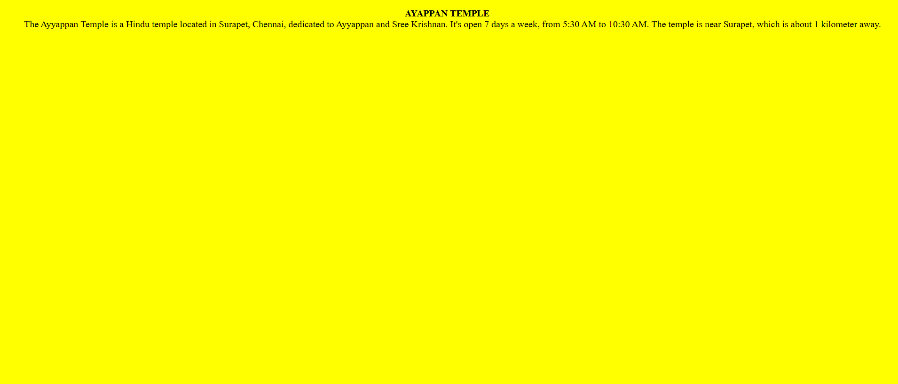
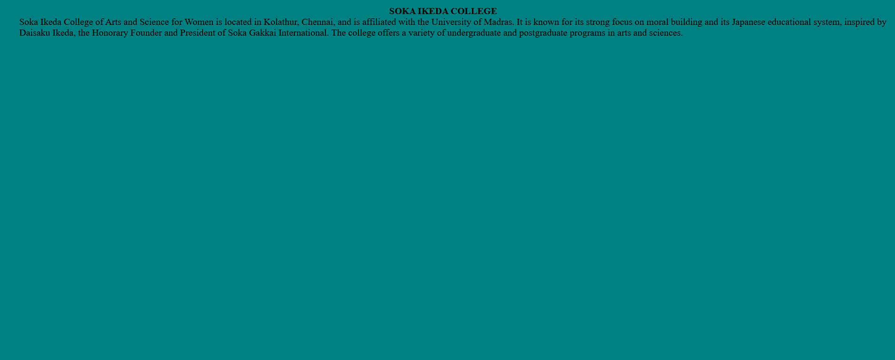
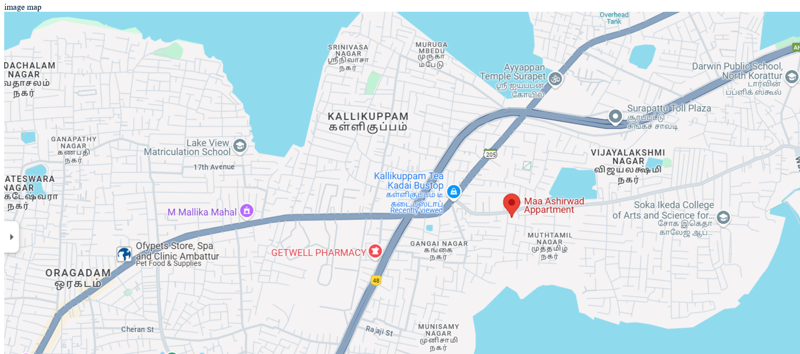

# Ex04 Places Around Me
<<<<<<< HEAD
## Date: 
=======
## Date: 24.04.2025
>>>>>>> cffd959 (Success)

## AIM
To develop a website to display details about the places around my house.

## DESIGN STEPS

### STEP 1
Create a Django admin interface.

### STEP 2
Download your city map from Google.

### STEP 3
Using ```<map>``` tag name the map.

### STEP 4
Create clickable regions in the image using ```<area>``` tag.

### STEP 5
Write HTML programs for all the regions identified.

### STEP 6
Execute the programs and publish them.

## CODE
<<<<<<< HEAD


## OUTPUT


=======
```
Soka Ikeda College.html

<!DOCTYPE html>
<html>
<head>
    <title>College</title>
</head>
<body bgcolor="teal">
    <dl>
        <dt align="center"><strong>SOKA IKEDA COLLEGE</strong></dt>
        <dd>
            Soka Ikeda College of Arts and Science for Women is located in Kolathur, Chennai, and is affiliated with the University of Madras. It is known for its strong focus on moral building and its Japanese educational system, inspired by Daisaku Ikeda, the Honorary Founder and President of Soka Gakkai International. The college offers a variety of undergraduate and postgraduate programs in arts and sciences.
        </dd>
    </dl>
</body>
</html>

Kallikuppam Bus Stop.html

<!DOCTYPE html>
<html>
<head>
    <title>Bus Stop</title>
</head>
<body bgcolor="silver">
    <dl>
        <dt align="center"><strong>KALLIKUPPAM BUS STOP</strong></dt>
        <dd>
            Kallikuppam is a bus stop in Chennai, Tamil Nadu, India. It's a 2-minute walk from the Kallikuppam station and serves as a stop for various bus lines, including 104, 62T, and S43. The nearest train station is Ambattur, which is a 37-minute walk away.
        </dd>
    </dl>
</body>
</html>

Ayappan Temple.html

<!DOCTYPE html>
<html>
<head>
    <title>Temple</title>
</head>
<body bgcolor="yellow">
    <dl>
        <dt align="center"><strong>AYAPPAN TEMPLE</strong></dt>
        <dd>
            The Ayyappan Temple is a Hindu temple located in Surapet, Chennai, dedicated to Ayyappan and Sree Krishnan. It's open 7 days a week, from 5:30 AM to 10:30 AM. The temple is near Surapet, which is about 1 kilometer away.
        </dd>
    </dl>
</body>
</html>
```

## OUTPUT





>>>>>>> cffd959 (Success)
## RESULT
The program for implementing image maps using HTML is executed successfully.
